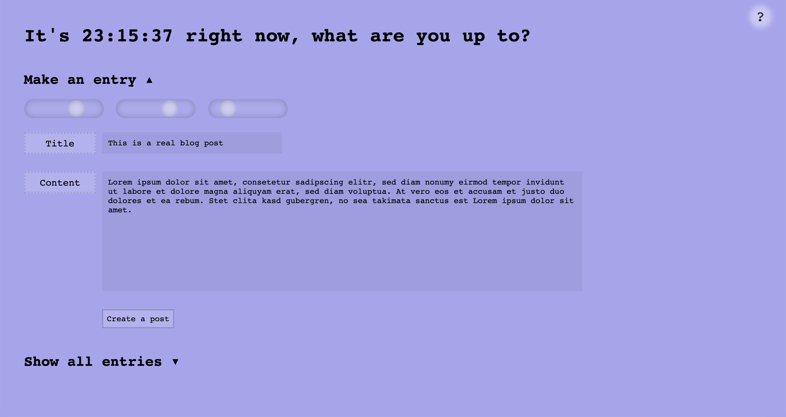

# Mood Pad ✏️

Concept, Design & Development: Tim Jungmann

### Pick a color based on your mood and write a blog-style entry.

[try it out ↗︎](https://timjungmann.github.io/mood-pad/)

All entries are stored in your browser's local storage, clearing your cache will erase them.

Make an entry:
- Use the three sliders (RGB) to pick a color that reflects your mood at the time of writing
- Write a title and content in the respective fields
- Click 'Create a post' to save it to your collection
- Every post is saved with a timestamp of day and time of creation

Show all entries:
- Shows a collection with all your past entries, most recently created or edited first
- Click title of a post to enlarge it
- Click ✏️ to edit a post
- Click ✅ to save and update timestamp
- Click ❌ to delete a post

Recommended use: diary or private twitter

